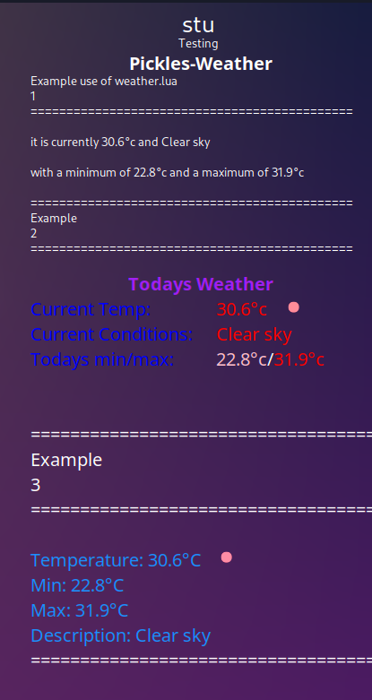

# pickles-weather

<!-- Improved compatibility of back to top link: See: https://github.com/othneildrew/Best-README-Template/pull/73 -->
<a id="readme-top"></a>
<!--
*** Thanks for checking out the Best-README-Template. If you have a suggestion
*** that would make this better, please fork the repo and create a pull request
*** or simply open an issue with the tag "enhancement".
*** Don't forget to give the project a star!
*** Thanks again! Now go create something AMAZING! :D
-->


<!-- PROJECT SHIELDS -->
<!--
*** I'm using markdown "reference style" links for readability.
*** Reference links are enclosed in brackets [ ] instead of parentheses ( ).
*** See the bottom of this document for the declaration of the reference variables
*** for contributors-url, forks-url, etc. This is an optional, concise syntax you may use.
*** https://www.markdownguide.org/basic-syntax/#reference-style-links
-->
[![Contributors][contributors-shield]][contributors-url]
[![Forks][forks-shield]][forks-url]
[![Stargazers][stars-shield]][stars-url]
[![Issues][issues-shield]][issues-url]
[![project_license][license-shield]][license-url]


<!-- PROJECT LOGO -->
<br />
<div align="center">
  <a href="https://github.com/Stu-Pickles3047/pickles-weather">
    <!-- -->
  </a>

<h3 align="center">Pickles-Weather</h3>

  <p align="center">
    Pickles Weather is a project I created for myself to teach myself Lua and Conky
    <br />
   <!-- <a href="https://github.com/Stu-Pickles3047/pickles-weather"><strong>Explore the docs »</strong></a> -->
    <br />
    <br />
    <a href="https://github.com/Stu-Pickles3047/pickles-weather">View Demo</a>
    &middot;
    <a href="https://github.com/Stu-Pickles3047/pickles-weather/issues/new?labels=bug&template=bug-report---.md">Report Bug</a>
    &middot;
    <a href="https://github.com/Stu-Pickles3047/pickles-weather/issues/new?labels=enhancement&template=feature-request---.md">Request Feature</a>
  </p>
</div>


<!-- TABLE OF CONTENTS -->
<details>
  <summary>Table of Contents</summary>
  <ol>
    <li>
      <a href="#about-the-project">About The Project</a>
      <ul>
        <li><a href="#built-with">Built With</a></li>
      </ul>
    </li>
    <li>
      <a href="#getting-started">Getting Started</a>
      <ul>
        <li><a href="#prerequisites">Prerequisites</a></li>
        <li><a href="#installation">Installation</a></li>
      </ul>
    </li>
    <li><a href="#usage">Usage</a></li>
    <li><a href="#roadmap">Roadmap</a></li>
    <li><a href="#contributing">Contributing</a></li>
    <li><a href="#license">License</a></li>
    <li><a href="#contact">Contact</a></li>
    <li><a href="#acknowledgments">Acknowledgments</a></li>
  </ol>
</details>


<!-- ABOUT THE PROJECT -->
## About The Project

Pickles Weather | (https://github.com/Stu-Pickles3047/pickles-weather)

Pickles Weather is an LUA script designed to run with conky.

It will give
- Current Temp
- Min Temp
- Max Temp
- Current Conditions
- Weather im in conky format

<p align="right">(<a href="#readme-top">back to top</a>)</p>


### Built With

* [](https://github.com/brndnmtthws/conky) 
* [![Lua][Lua]][Lua-url]
* 


<p align="right">(<a href="#readme-top">back to top</a>)</p>


<!-- GETTING STARTED -->
## Getting Started

### Prerequisites

Open a terminal and change to your Conky config directory (On Garuda this is found in /home/username/.conky/)
* 
  ```sh
  cd ~/.conky/
  ```

### Installation

1. 
Open a terminal and change to your Conky config directory (On Garuda this is found in /home/username/.conky/)
* 
  ```sh
  cd ~/.conky/
  ```

2. Clone the repo 
* 
   ```sh
   git clone https://github.com/Stu-Pickles3047/pickles-weather.git 
   ```

3.  Change into directory
* 
    ```sh
      cd pickles-weather
   ```

4.Either run setup.sh and then Continue or 
Open settings.lua un your favourite editor
  * 
    ```lua
    kate settings.lua
    ```
5. Follow the instructions in settings.lua
* 
```lua
Change Latitude
Change Longitude
Icon size, only adjust if you need icon bigger or smaller
Edit save_loc should be something like 
    save_loc = '/home/username/.conky/pickles-weather.json',
Edit icon_path as above but path to icons folder
save_loc and icon_path will have changed and be correct if you ran setup.sh
```
Save and close settings.lua

6. This step only needed if you didn't use setup.sh
Adjust conk.conf as per pickle-weather.examples.conk.conf
* Open pickles-weather.examples.conky.conf
```kate
Edit line
    lua_load = 'path/to/conky.conf/Pickles-Weather/weather.lua' ,
to location where you weather.lua is located
```
Save and close

7. Run conky
  ```sh
conky -d -c /path/to/pickles-weather/pickle-weather.examples.conk.conf
```
8. Enjoy.
* Dont forget to try it out in your own conky, and report any bugs.

<p align="right">(<a href="#readme-top">back to top</a>)</p>


<!-- USAGE EXAMPLES -->
## Usage

Conky Instructions
<br>
Example:<br>
<a href="conky.png"></a>

<!-- ROADMAP -->
## Roadmap

- [ ]Add Further Setup Instructions
- [ ] Add dependency check
- [ ] Add setup script
- [ ] Add better conky example
  

See the [open issues](https://github.com/Stu-Pickles3047/pickles-weather/issues) for a full list of proposed features (and known issues).

<p align="right">(<a href="#readme-top">back to top</a>)</p>


<!-- CONTRIBUTING -->
## Contributing

Contributions are what make the open source community such an amazing place to learn, inspire, and create. Any contributions you make are **greatly appreciated**.

If you have a suggestion that would make this better, please fork the repo and create a pull request. You can also simply open an issue with the tag "enhancement".
Don't forget to give the project a star! Thanks again!

1. Fork the Project
2. Create your Feature Branch (`git checkout -b feature/AmazingFeature`)
3. Commit your Changes (`git commit -m 'Add some AmazingFeature'`)
4. Push to the Branch (`git push origin feature/AmazingFeature`)
5. Open a Pull Request

<p align="right">(<a href="#readme-top">back to top</a>)</p>

### Top contributors:

<a href="https://github.com/Stu-Pickles3047/pickles-weather/graphs/contributors">
  
</a>


<!-- LICENSE -->
## License

Distributed under the unlicense. See `LICENSE.txt` for more information.

<p align="right">(<a href="#readme-top">back to top</a>)</p>


<!-- CONTACT -->
## Contact

Stu Pickles - 

Project Link: [https://github.com/Stu-Pickles3047/pickles-weather](https://github.com/Stu-Pickles3047/pickles-weather)

<p align="right">(<a href="#readme-top">back to top</a>)</p>


<!-- ACKNOWLEDGMENTS -->
## Acknowledgments

* []()
* []()
* []()

<p align="right">(<a href="#readme-top">back to top</a>)</p>


<!-- MARKDOWN LINKS & IMAGES -->
<!-- https://www.markdownguide.org/basic-syntax/#reference-style-links -->
[contributors-shield]: https://img.shields.io/github/contributors/Stu-Pickles3047/pickles-weather.svg?style=for-the-badge
[contributors-url]: https://github.com/Stu-Pickles3047/pickles-weather/graphs/contributors
[forks-shield]: https://img.shields.io/github/forks/Stu-Pickles3047/pickles-weather.svg?style=for-the-badge
[forks-url]: https://github.com/Stu-Pickles3047/pickles-weather/network/members
[stars-shield]: https://img.shields.io/github/stars/Stu-Pickles3047/pickles-weather.svg?style=for-the-badge
[stars-url]: https://github.com/Stu-Pickles3047/pickles-weather/stargazers
[issues-shield]: https://img.shields.io/github/issues/Stu-Pickles3047/pickles-weather.svg?style=for-the-badge
[issues-url]: https://github.com/Stu-Pickles3047/pickles-weather/issues
[license-shield]: https://img.shields.io/github/license/Stu-Pickles3047/pickles-weather.svg?style=for-the-badge
[license-url]: https://github.com/Stu-Pickles3047/pickles-weather/LICENSE.txt
[product-screenshot]: conky.png
[Lua]: https://img.shields.io/badge/Lua-2C2D72?style=for-the-badge&logo=nextdotjs&logoColor=white
[Lua-url]: https://lua.org/

